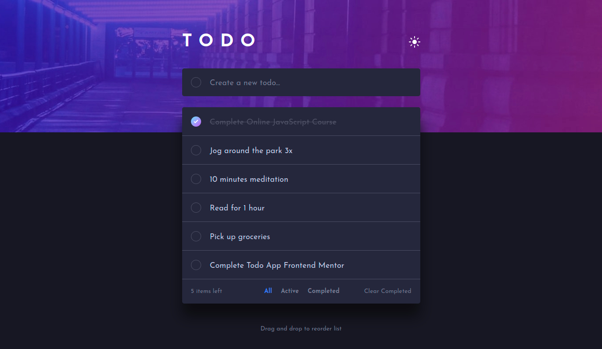

# Frontend Mentor - Todo app solution

This is a solution to the [Todo app challenge on Frontend Mentor](https://www.frontendmentor.io/challenges/todo-app-Su1_KokOW). Frontend Mentor challenges help you improve your coding skills by building realistic projects.

## Table of contents

- [Overview](#overview)
  - [The challenge](#the-challenge)
  - [Screenshot](#screenshot)
  - [Links](#links)
- [My process](#my-process)
  - [Built with](#built-with)
  - [Continued development](#continued-development)
- [Author](#author)

## Overview

### The challenge

- View the optimal layout for the app depending on their device's screen size
- See hover states for all interactive elements on the page
- Add new todos to the list
- Mark todos as complete
- Delete todos from the list
- Filter by all/active/complete todos
- Clear all completed todos
- Toggle light and dark mode
- Bonus: Drag and drop to reorder items on the list

### Screenshot

### Links

- [Solution URL](https://www.frontendmentor.io/solutions/todo-app-xffkcUzX9F)
- [Preview URL](https://abdelrahmancsdev.github.io/todo-app/)

## My process

### Built with

- ReactJS
- CSS Modules
- Sass
- Beautiful DnD
- Vite

### Continued development

I will work on more Advanced projects.

## Author

- Website - [Abdelrahman Nasser](https://www.abdelrahmancs.dev)
- Frontend Mentor - [@abdelrahmancsdev](https://www.frontendmentor.io/profile/abdelrahmancsdev)
- Linkedin - [@abdelrahmancsdev](https://www.linkedin.com/in/abdelrahmancsdev/)
